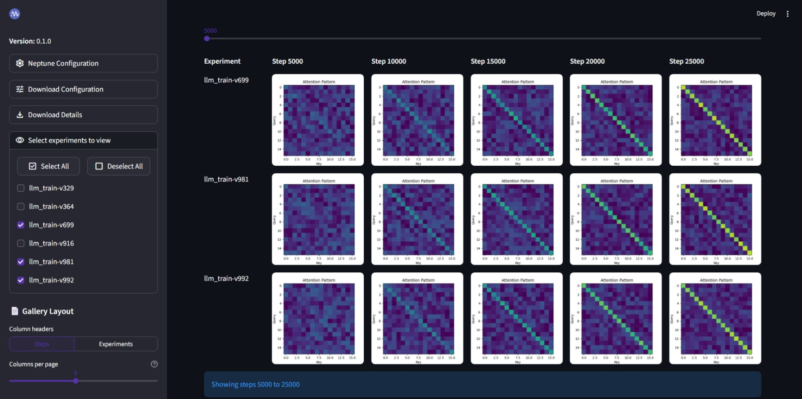

# Neptune file-series comparison tool

A Streamlit application for downloading, visualizing, and comparing media files logged as series across Neptune experiments.

[](./assets/screenshot.jpeg)

## Features

- **Interactive media gallery**: Compare images and videos across experiments and training steps
- **Flexible layout**: Switch between step-based and experiment-based column layouts
- **Smart pagination**: Navigate through large datasets with configurable columns per page
- **Experiment filtering**: Select specific experiments using regex patterns and interactive toggles
- **Media support**: View images (PNG, JPG, GIF, BMP) and videos (MP4, AVI, MOV, MKV, WebM)

---

## Installation and usage

### Cloud-hosted version

SaaS users can try the hosted version of the app with zero local setup: [](https://neptune-file-comparison.streamlit.app/)

### Local version

1. Clone the repository
2. Navigate to `utils/visualization_tools/file_comparison_app/`
3. Install dependencies:

   ```bash
   pip install -r requirements.txt
   ```

4. Run the Streamlit app:

   ```bash
   streamlit run file_comparison_app.py
   ```

5. Open your browser and navigate to the provided URL (usually `http://localhost:8501`)

---

## Changelog

### Version 0.1.1 (2025-10-10)

- Fixed handling of Neptune API key and project name

### Version 0.1.0 (2025-10-09)

- Initial release

## Support and feedback

We welcome your feedback and contributions!

- For issues or feature requests related to this tool, please open a [GitHub Issue][Github issues].
- For general Neptune support, visit the [Neptune support center][Support center].

---

## License

Copyright (c) 2025, Neptune Labs Sp. z o.o.

Licensed under the Apache License, Version 2.0 (the "License");
you may not use this file except in compliance with the License.
You may obtain a copy of the License at http://www.apache.org/licenses/LICENSE-2.0

Unless required by applicable law or agreed to in writing, software distributed under the License is distributed on an "AS IS" BASIS,
WITHOUT WARRANTIES OR CONDITIONS OF ANY KIND, either express or implied.
See the License for the specific language governing permissions and limitations under the License.

[GitHub issues]: https://github.com/neptune-ai/scale-examples/issues/new
[Support center]: https://support.neptune.ai/
